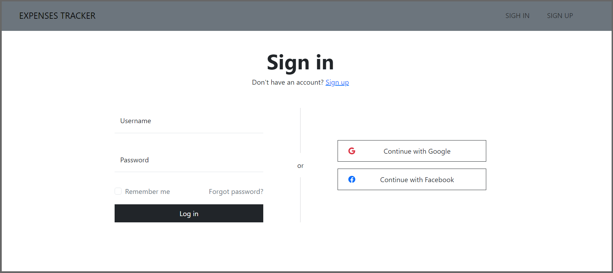

# Expenses Tracker WebApp

## Overview

The Expenses Tracker App is a financial management application developed using **Java, Spring Boot, Spring Security, Spring Data JPA, Thymeleaf, Bootstrap, and MySQL**.

The application provides user authentication and authorization, allowing users to securely sign up, sign in, and manage their expenses through CRUD operations. Users can also filter their expenses to efficiently organize and analyze their financial data.

The application is containerized using **Docker and Docker Compose**, with separate containers for the Spring Boot application and MySQL database.

## Technologies Used

* Java 17
* Spring Boot
* Spring MVC
* Spring Security
* Spring Data JPA
* MySQL
* Thymeleaf
* Bootstrap
* Maven
* Docker
* Docker Compose

## Features

* **User Authentication and Authorization:** Securely sign up, sign in, and access the application using Spring Security.
* **CRUD Operations:** Add, view, update, and delete expenses.
* **Filtering:** Filter and organize expenses based on available criteria.
* **MySQL Database:** Store application data in a MySQL database.
* **Dockerized Application:** Run the Spring Boot application and MySQL database using Docker Compose.
* **Persistent Database Storage:** MySQL data is stored using a persistent bind mount.

---

# Docker

The application uses a **multi-stage Docker build**.

The Dockerfile contains two stages:

1. **Stage 1 — Build the Spring Boot application**
2. **Stage 2 — Run the Spring Boot application**

Using multiple stages keeps Maven and other build tools out of the final runtime image.

## Dockerfile

```dockerfile
# ============================================================
# STAGE 1: BUILD THE SPRING BOOT APPLICATION
# ============================================================

# Use a Maven image that already contains:
# - Maven 3.9 → used to build the project
# - Eclipse Temurin → Java distribution
# - Java 17 → required by our project (pom.xml)
# "AS builder" gives this build stage the name "builder"
FROM maven:3.9-eclipse-temurin-17 AS builder

# Set /app as the working directory inside the container.
# All following commands in this stage will run from /app.
# If /app does not exist, Docker creates it automatically.
WORKDIR /app

# Copy the pom.xml file from our local project
# into the current working directory inside the container (/app).
# pom.xml contains Maven's project configuration,
# dependencies, plugins, and Java version information.
COPY pom.xml .

# Copy the src directory from our local project
# into /app/src inside the container.
# src contains our Java source code, resources, templates, etc.
COPY src ./src

# Run Maven to build/package the Spring Boot application.
#
# mvn        → execute Maven
# clean      → remove previous build files
# package    → compile the code and create the JAR file
# -DskipTests → skip running tests during the Docker build
#
# After this command, Maven creates the JAR inside:
# /app/target/*.jar
RUN mvn clean package -DskipTests


# ============================================================
# STAGE 2: RUN THE SPRING BOOT APPLICATION
# ============================================================

# Start a NEW image for running the application.
#
# eclipse-temurin → Java distribution
# 17             → Java version required by our project
# jre            → Java Runtime Environment; we only need
#                  Java to RUN the already-built JAR.
#
# Maven and the source code are not needed in this stage.
FROM eclipse-temurin:17-jre

# Set /app as the working directory inside the runtime container.
WORKDIR /app

# Copy the JAR created in STAGE 1 into STAGE 2.
#
# --from=builder
#   → copy the file from the Docker stage named "builder"
#
# /app/target/*.jar
#   → location of the JAR created by Maven in Stage 1
#   → *.jar means any JAR file in the target directory
#
# app.jar
#   → rename the copied JAR to a simple, predictable name
#      inside the runtime container
COPY --from=builder /app/target/*.jar app.jar

# Document that the Spring Boot application listens
# on port 8080 inside the container.
#
# 8080 comes from Spring Boot's default server port,
# unless it has been changed in application.properties/yml.
EXPOSE 8080

# Command that runs automatically when the container starts.
#
# java     → start Java
# -jar     → tell Java to execute a JAR file
# app.jar  → the JAR we copied from Stage 1
#
# This starts our Spring Boot application.
ENTRYPOINT ["java", "-jar", "app.jar"]
```

---

# Docker Compose

Docker Compose is used to run the **Spring Boot application and MySQL database together**.

There are two runtime services:

```text
Spring Boot Application
        │
        │ Docker Network
        ↓
      MySQL
```

Maven is **not a separate Docker Compose service**. Maven is used in **Stage 1 of the Dockerfile** to build the Spring Boot JAR.

## Docker Compose Configuration

```yaml
services:

  mainapp:
    build: .
    image: expenses-tracker-app

    container_name: ExpensesTrackerApp-container

    environment:
      SPRING_DATASOURCE_USERNAME: root
      SPRING_DATASOURCE_PASSWORD: Test@123
      SPRING_DATASOURCE_URL: "jdbc:mysql://mysql:3306/expenses_tracker?allowPublicKeyRetrieval=true&useSSL=false"

    ports:
      - "8080:8080"

    networks:
      - expenses-tracker-network

    depends_on:
      mysql:
        condition: service_healthy

    restart: unless-stopped


  mysql:
    image: mysql:latest

    container_name: mysql-container

    environment:
      MYSQL_DATABASE: expenses_tracker
      MYSQL_ROOT_PASSWORD: Test@123

    volumes:
      - ./mysql-database:/var/lib/mysql

    networks:
      - expenses-tracker-network

    restart: unless-stopped

    healthcheck:
      test: ["CMD", "mysqladmin", "ping", "-h", "localhost", "-uroot", "-pTest@123"]
      interval: 10s
      timeout: 5s
      retries: 5
      start_period: 30s


networks:
  expenses-tracker-network:
```

---

# Understanding the JDBC URL

The Spring Boot application connects to MySQL using:

```text
jdbc:mysql://mysql:3306/expenses_tracker
```

The URL can be broken down as:

```text
jdbc:mysql://mysql:3306/expenses_tracker
│    │       │     │      │
│    │       │     │      └── Database name
│    │       │     └───────── MySQL port
│    │       └─────────────── MySQL service name
│    └─────────────────────── MySQL database type
└──────────────────────────── Java Database Connectivity
```

### `jdbc:mysql`

Indicates that Java is connecting to a **MySQL database using JDBC**.

### `mysql`

This is the **Docker Compose service name** of the MySQL container.

Docker's internal DNS allows the Spring Boot container to find the MySQL container using this service name.

### `3306`

This is the default MySQL port.

### `expenses_tracker`

This is the MySQL database name.

## Additional Parameters

The URL also contains:

```text
?allowPublicKeyRetrieval=true&useSSL=false
```

These are additional MySQL JDBC connection parameters.

* `allowPublicKeyRetrieval=true` allows the JDBC driver to retrieve the MySQL server public key when required for authentication.
* `useSSL=false` disables SSL/TLS for the database connection.

---

# Important: `mysql` vs `mysql_db` Service Name

One important Docker Compose concept is that the hostname used by the Spring Boot application must match the **Docker Compose service name**.

For example:

```yaml
services:

  mysql:
    image: mysql:latest
    container_name: mysql-container
```

Here:

```text
mysql
    ↓
Docker Compose service name

mysql-container
    ↓
Container name
```

Therefore, Spring Boot connects using:

```yaml
SPRING_DATASOURCE_URL: jdbc:mysql://mysql:3306/expenses_tracker
```

The hostname is:

```text
mysql
```

because `mysql` is the Compose service name.

## What If We Rename `mysql` to `mysql_db`?

Suppose we change the service name:

```yaml
services:

  mysql_db:
    image: mysql:latest
    container_name: mysql-container
```

Now the Spring Boot JDBC URL must also change:

```yaml
SPRING_DATASOURCE_URL: jdbc:mysql://mysql_db:3306/expenses_tracker
```

It must **not** remain:

```yaml
SPRING_DATASOURCE_URL: jdbc:mysql://mysql:3306/expenses_tracker
```

because there is no longer a Compose service called `mysql`.

The same applies to `depends_on`.

If the service is:

```yaml
mysql_db:
```

then:

```yaml
depends_on:
  - mysql_db
```

should be used.

## Example of Correct Configuration

```yaml
services:

  mysql_db:
    image: mysql:latest

  java_app:
    environment:
      SPRING_DATASOURCE_URL: jdbc:mysql://mysql_db:3306/expenses_tracker

    depends_on:
      - mysql_db
```

The communication works like this:

```text
Spring Boot Container
        │
        │ jdbc:mysql://mysql_db:3306/expenses_tracker
        ↓
   mysql_db service
        │
        ↓
 MySQL Container
```

## Example of Incorrect Configuration

```yaml
services:

  mysql_db:
    image: mysql:latest

  java_app:
    environment:
      SPRING_DATASOURCE_URL: jdbc:mysql://mysql:3306/expenses_tracker

    depends_on:
      - mysql_db
```

This is incorrect because:

```text
Compose service name = mysql_db
JDBC hostname       = mysql
```

The names do not match.

## Key Rule

> **For container-to-container communication in Docker Compose, use the Docker Compose service name as the hostname.**

For example:

```text
services:
  mysql:
```

means:

```text
jdbc:mysql://mysql:3306/expenses_tracker
```

And:

```text
services:
  mysql_db:
```

means:

```text
jdbc:mysql://mysql_db:3306/expenses_tracker
```

### Service Name vs Container Name

| Configuration                     | Purpose                                 |
| --------------------------------- | --------------------------------------- |
| `mysql:`                          | Docker Compose service name             |
| `mysql_db:`                       | Alternative Docker Compose service name |
| `container_name: mysql-container` | Custom Docker container name            |
| `jdbc:mysql://mysql:3306/...`     | Uses `mysql` service as hostname        |
| `jdbc:mysql://mysql_db:3306/...`  | Uses `mysql_db` service as hostname     |

**Remember:** Changing the Compose service name requires updating the JDBC hostname and `depends_on` references.

---

# MySQL Database Persistence

The MySQL service uses a **bind mount**:

```yaml
volumes:
  - ./mysql-database:/var/lib/mysql
```

This maps the local directory:

```text
./mysql-database
```

to the MySQL data directory inside the container:

```text
/var/lib/mysql
```

Therefore:

```text
Local machine
     │
     │ ./mysql-database
     ↓
MySQL container
     │
     │ /var/lib/mysql
     ↓
MySQL database files
```

This allows the database data to persist when the MySQL container is recreated.

## `.dockerignore`

Because `mysql-database` is located inside the project directory, Docker may try to include the database files in the Docker build context.

To prevent this, create a `.dockerignore` file in the project root:

```text
mysql-database/
target/
.git/
.gitignore
.env
```

This prevents unnecessary or sensitive files from being sent to Docker during the build.

---

# Environment Variables

Create a `.env` file in the project directory:

```env
MYSQL_ROOT_PASSWORD=your_secure_password
```

The `.env` file can be used by Docker Compose to provide environment-specific values.

Do **not** commit `.env` to GitHub.

Add it to `.gitignore`:

```text
.env
```

For production deployments, use a secure secret-management solution instead of storing passwords directly in the Compose file.

---

# Running the Application with Docker

## 1. Build the Docker Image

```bash
docker compose build
```

This executes the Dockerfile.

During Stage 1:

```text
Maven + Java 17
       ↓
Compile source code
       ↓
Create JAR
```

During Stage 2:

```text
Java 17 JRE
       ↓
Copy JAR
       ↓
Run Spring Boot
```

## 2. Start the Containers

```bash
docker compose up -d
```

This starts:

* Spring Boot application
* MySQL database

## 3. Check Running Containers

```bash
docker compose ps
```

## 4. View Spring Boot Logs

```bash
docker compose logs mainapp
```

To follow the logs:

```bash
docker compose logs -f mainapp
```

## 5. View MySQL Logs

```bash
docker compose logs mysql
```

To follow the logs:

```bash
docker compose logs -f mysql
```

## 6. Stop the Application

```bash
docker compose down
```

The MySQL data stored in:

```text
./mysql-database
```

remains because it is stored using a bind mount.

---

# Access the Application

After the containers are running, open:

```text
http://localhost:8080
```

For an AWS EC2 deployment, use:

```text
http://<EC2-PUBLIC-IP>:8080
```

Make sure the EC2 Security Group allows inbound TCP traffic on port `8080` if you are accessing the application directly from the internet.

The Docker Compose port mapping is:

```yaml
ports:
  - "8080:8080"
```

This means:

```text
Host machine port 8080
        │
        ↓
Spring Boot container port 8080
```

---

# Running Without Docker

## 1. Configure MySQL

Create the `expenses_tracker` database in MySQL and configure the database connection in:

```text
src/main/resources/application.properties
```

## 2. Build the Application

```bash
mvn clean package
```

## 3. Run the JAR

```bash
java -jar target/<generated-jar-name>.jar
```

## 4. Access the Application

Open:

```text
http://localhost:8080
```

---

# Troubleshooting

## Spring Boot Cannot Connect to MySQL

First check the containers:

```bash
docker compose ps
```

Then check Spring Boot logs:

```bash
docker compose logs mainapp
```

Check MySQL logs:

```bash
docker compose logs mysql
```

### Check the JDBC hostname

If your Compose service is:

```yaml
mysql:
```

your JDBC URL should use:

```text
jdbc:mysql://mysql:3306/expenses_tracker
```

If your Compose service is:

```yaml
mysql_db:
```

your JDBC URL should use:

```text
jdbc:mysql://mysql_db:3306/expenses_tracker
```

The service name and JDBC hostname must match.

### Check MySQL Health

The MySQL service has a healthcheck:

```yaml
healthcheck:
  test: ["CMD", "mysqladmin", "ping", "-h", "localhost", "-uroot", "-pTest@123"]
  interval: 10s
  timeout: 5s
  retries: 5
  start_period: 30s
```

The Spring Boot service uses:

```yaml
depends_on:
  mysql:
    condition: service_healthy
```

This makes Docker Compose wait for the MySQL service to become healthy before starting the Spring Boot application.

---

# Useful Docker Commands

### List Running Containers

```bash
docker ps
```

### List All Containers

```bash
docker ps -a
```

### List Docker Images

```bash
docker images
```

### Check Compose Services

```bash
docker compose ps
```

### Rebuild the Application

```bash
docker compose build --no-cache
```

### Recreate Containers

```bash
docker compose up -d --build
```

### Stop and Remove Containers

```bash
docker compose down
```

### Stop and Remove Containers and Volumes

```bash
docker compose down -v
```

> **Warning:** Do not use `docker compose down -v` if you need to preserve Docker-managed volumes. For this project, the MySQL database uses a bind mount, so `./mysql-database` is outside the Docker volume system.

---

# Screenshots





